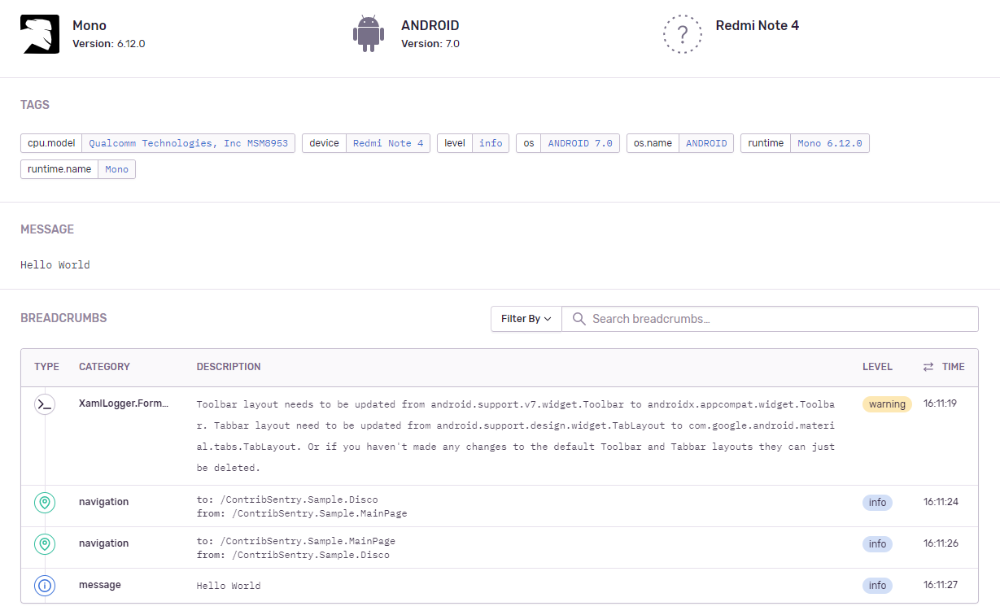

<p align="center">
  <a href="https://sentry.io/?utm_source=github&utm_medium=logo" target="_blank">
    <picture>
      <source srcset="https://sentry-brand.storage.googleapis.com/sentry-logo-white.png" media="(prefers-color-scheme: dark)" />
      <source srcset="https://sentry-brand.storage.googleapis.com/sentry-logo-black.png" media="(prefers-color-scheme: light), (prefers-color-scheme: no-preference)" />
      
    </picture>
  </a>
</p>

_Bad software is everywhere, and we're tired of it. Sentry is on a mission to help developers write better software faster, so we can get back to enjoying technology. If you want to join us [<kbd>**Check out our open positions**</kbd>](https://sentry.io/careers/)_
 
Sentry SDK for Xamarin
===========

[](https://github.com/getsentry/sentry-dotnet-xamarin/actions?query=branch%3Amain)
[](https://discord.gg/PXa5Apfe7K)  

|      Integrations             |    Downloads     |    NuGet Stable     |    NuGet Preview     |
| ----------------------------- | :-------------------: | :-------------------: | :-------------------: |
|  **Sentry.Xamarin.Forms**     | [](https://www.nuget.org/packages/Sentry.Xamarin.Forms) | [](https://www.nuget.org/packages/Sentry.Xamarin.Forms)   |    [](https://www.nuget.org/packages/Sentry.Xamarin.Forms)   |
|  **Sentry.Xamarin**     | [](https://www.nuget.org/packages/Sentry.Xamarin) | [](https://www.nuget.org/packages/Sentry.Xamarin)   |    [](https://www.nuget.org/packages/Sentry.Xamarin)   |

Sentry.Xamarin is the tool to go for Xamarin that enriches your errors with valuable data, like breadcrumbs, tags, issue grouping and more!.

Includes for all Platforms supported by Xamarin Essentials:
* Automatic Navigation breacrumbs. (Xamarin.Forms)
* Xaml warnings as breadcrumbs. (Xamarin.Forms)
* Simulator flag.
* Device manufacturer.
* Device model.
* Operational system name and version.
* Screen information (Pixel density and resolution).
* Connectivity status.

Additionaly, Android and IOS will include additional information:
* Free Internal memory (Android/iOS).
* Total RAM (Android/iOS).
* CPU model (Android).
<p align="center">
  <b>BEFORE</b>
  
  
</p>
<p align="center">
  <b>AFTER</b>
  
  
</p>

## Setup
All you need to do is to initialize Xamarin integration by calling SentryXamarin.Init, and, it's recommended to start Sentry Xamarin SDK as early as possible, for an example, the start of OnCreate on MainActivity for Android, and, the top of FinishedLaunching on AppDelegate for iOS)

```C#
SentryXamarin.Init(options =>
{
    options.Dsn = "__YOUR__DSN__";
    options.AddXamarinFormsIntegration();
});

```

If your app uses Xamarin.Forms you can also use the package Sentry.Xamarin.Forms and initialize the SDK with additional line `options.AddXamarinFormsIntegration()`.

### Android
On your MainActivity
```C#
public class MainActivity : global::Xamarin.Forms.Platform.Android.FormsAppCompatActivity
{
    protected override void OnCreate(Bundle savedInstanceState)
    {
        SentryXamarin.Init(options =>
        {
            options.Dsn = "__YOUR__DSN__";
            options.AddXamarinFormsIntegration();
        });
        ...
```

### iOS
On AppDelegate.cs
```C#
public partial class AppDelegate : global::Xamarin.Forms.Platform.iOS.FormsApplicationDelegate
{
    public override bool FinishedLaunching(UIApplication app, NSDictionary options)
    {
        SentryXamarin.Init(options =>
        {
            options.Dsn = "__YOUR__DSN__";
            options.AddXamarinFormsIntegration();
        });
        ...
```

### UWP
On App.Xaml.cs
```C#
sealed partial class App : Application
{
    protected override void OnLaunched(LaunchActivatedEventArgs e)
    {
        SentryXamarin.Init(options =>
        {
            options.Dsn = "__YOUR__DSN__";
            options.AddXamarinFormsIntegration();
        });
    ...        
```

## Compatibility

The package requires the following versions or newer:

* Tizen 4.0 (for Tizen)
* Xamarin.Android 9.0 (for Android)
* Xamarin.iOS 10.14 (for iOS)
* Universal Windows Platform 10.0.16299 (for UWP)
* Xamarin.Forms 4.6.0.726 (for Xamarin.Forms integration)
* Xamarin.Essentials 1.4.0
* Sentry 3.0.0


## Limitations

There are no line numbers on stack traces for UWP and in release builds for Android and iOS, furthermore, mono symbolication is not yet supported.

## Resources

* [](https://docs.sentry.io/platforms/dotnet/)
* [](https://forum.sentry.io/c/sdks)
* [](https://discord.gg/PXa5Apfe7K)  
* [](http://stackoverflow.com/questions/tagged/sentry)
* [](https://twitter.com/intent/follow?screen_name=getsentry)
