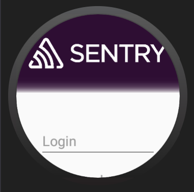
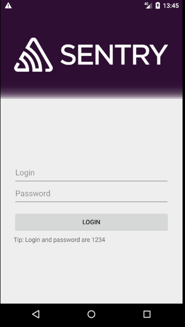
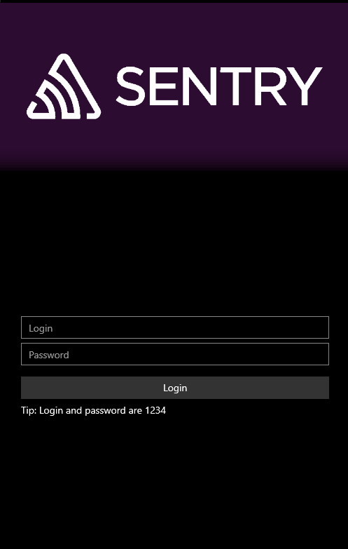
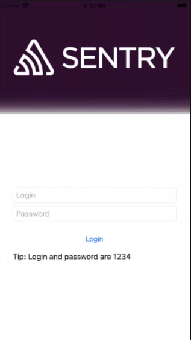

### Sample Xamarin.Forms app for iOS, Android and Windows

 
  <a href="https://sentry.io" target="_blank" align="center">
  <table>
  <tr>
    <td></td>
    <td></td>
    <td></td>
    <td></td>
    </tr>
   <tr>
     <td><h1 style="text-align:center;">Android Wear</h1></td>
     <td><h1 style="text-align:center;">Android Phone/Tablet</h1></td>
     <td><h1 style="text-align:center;">UWP</h1></td>
     <td><h1 style="text-align:center;">iOS</h1></td>
  </table>
 </a>
 

## Requirements:
 - Microsoft Visual Studio 2019 (Windows)
 - Microsoft Visual Studio for Mac (Mac)
 - Windows 10 1809 or higher (for UWP)
 
 ## About
 
 This demo demonstrates a complete working app where the main features of Sentry are shown. Those are:
 - Error Capturing.
 - Unhandled Error Capture.
 - Breadcrumbs
 - User Feedback.
